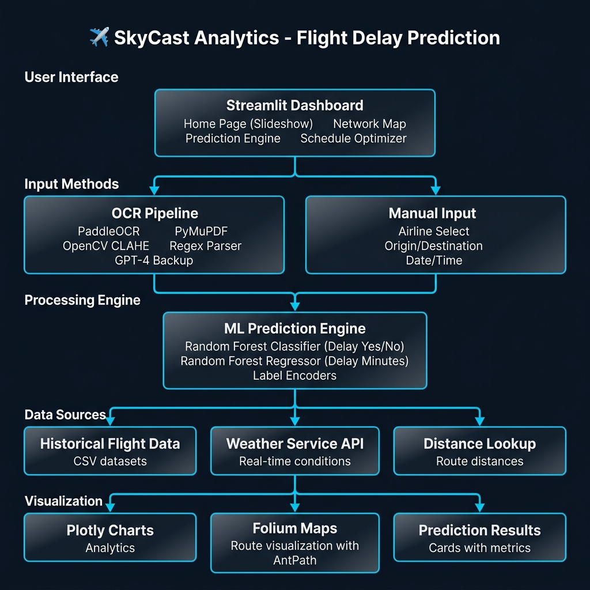
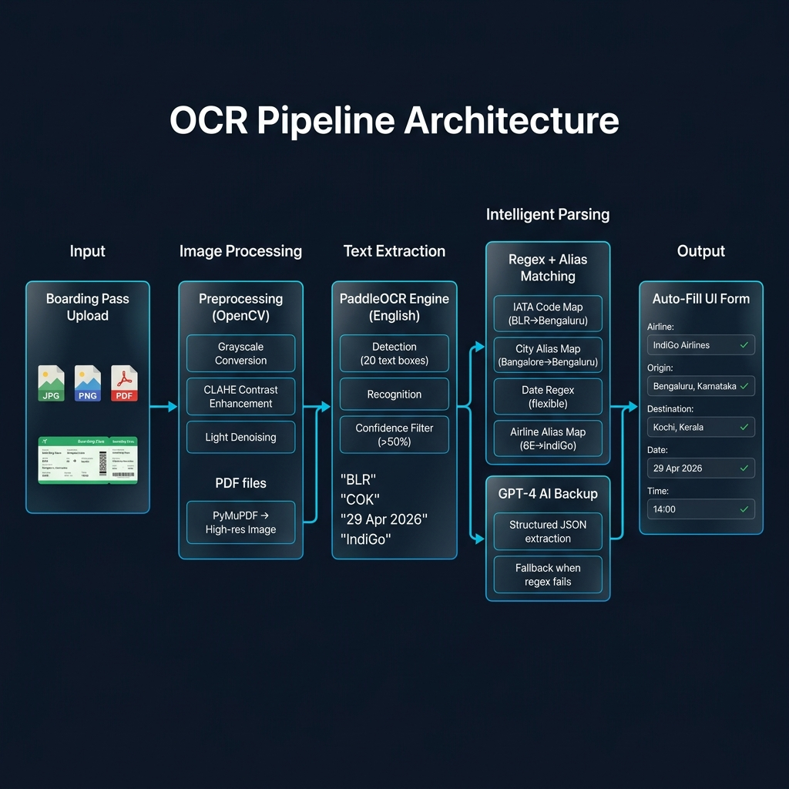

# ✈️ SkyCast Analytics — Flight Delay Prediction Engine

> Enterprise-grade predictive analytics for flight operations, powered by historical performance data, real-time meteorological conditions, and smart OCR-based ticket scanning.

---

## 📖 About the Project

**SkyCast Analytics** is a full-stack AI-powered flight delay prediction platform built for the Indian aviation sector. It combines machine learning, computer vision, and real-time weather data to predict whether a flight will be delayed — and by how many minutes.

Users can either manually enter flight details or simply **upload a photo of their boarding pass**, and the system automatically reads the ticket, extracts all relevant information, and predicts the delay instantly.

---

## ❓ Problem Statement

Flight delays cost the Indian aviation industry thousands of crores annually and cause massive inconvenience to millions of passengers. Current platforms only provide **reactive** tracking (telling you a flight is delayed after the fact). There is no accessible tool that:

- **Proactively predicts** delay probability before departure
- **Automatically reads** physical boarding passes to eliminate manual data entry
- **Combines** historical patterns with real-time weather for accurate forecasting

SkyCast Analytics solves all three problems in a single, beautiful dashboard.

---

## ✨ Key Features

| Feature | Description |
|---------|-------------|
| 🤖 **ML Prediction Engine** | Random Forest models trained on historical Indian flight data to predict delay probability and estimated delay minutes |
| 📸 **Smart Boarding Pass OCR** | Upload a ticket photo (JPG/PNG/PDF) → auto-extracts Airline, Origin, Destination, Date, Time |
| 🌦️ **Real-Time Weather** | Fetches live weather conditions for origin/destination airports to improve prediction accuracy |
| 🗺️ **Interactive Network Map** | Folium-based geospatial visualization with AntPath animated flight routes |
| 📊 **Data Analytics Dashboard** | Plotly-powered charts showing delay trends, airline comparisons, and route analysis |
| ⏰ **Schedule Optimizer** | Recommends the best time to fly and most reliable airlines for your route |

---

## 🛠️ Tech Stack

| Layer | Technology | Purpose |
|-------|-----------|---------|
| **Frontend** | Streamlit, CSS (Glassmorphism) | Interactive dashboard with dark theme |
| **ML Models** | Scikit-Learn (Random Forest) | Classification (delay yes/no) + Regression (delay minutes) |
| **OCR Engine** | PaddleOCR, OpenCV (CLAHE) | Reading text from boarding pass images |
| **PDF Support** | PyMuPDF (fitz) | Converting PDF tickets to high-res images |
| **AI Backup** | OpenAI GPT-4 API | Fallback parser when regex fails on complex tickets |
| **Weather** | WeatherService API | Real-time meteorological data |
| **Mapping** | Folium, streamlit-folium, AntPath | Interactive route maps with delay-aware coloring |
| **Data** | Pandas, NumPy | Data processing and feature engineering |
| **Charts** | Plotly Express | Interactive analytics visualizations |

---

## 🏗️ Project Architecture

The complete system architecture showing how all components connect:



### Architecture Flow:

```
User → Streamlit UI → [OCR Pipeline OR Manual Input]
                              ↓
                    Data Processing Layer
                    ├── Historical Flight Data (CSV)
                    ├── Weather Service API (Real-time)
                    └── Distance Lookup (Route km)
                              ↓
                    ML Prediction Engine
                    ├── Random Forest Classifier → Delay Yes/No
                    └── Random Forest Regressor → Delay Minutes
                              ↓
                    Visualization Layer
                    ├── Prediction Results (Cards + Metrics)
                    ├── Plotly Charts (Analytics)
                    └── Folium Maps (Route Visualization)
```

---

## 🔍 OCR Pipeline Architecture

The boarding pass scanning system — from photo upload to auto-filled form:



### How the OCR Pipeline Works (Step by Step):

#### Stage 1: Image Input
- Accepts **JPG, PNG, or PDF** boarding passes
- PDF files are converted to high-resolution images using **PyMuPDF (fitz)** at 300 DPI
- Falls back to PIL if PyMuPDF is unavailable

#### Stage 2: Preprocessing (OpenCV)
- Converts image to **grayscale**
- Applies **CLAHE (Contrast Limited Adaptive Histogram Equalization)** — this is critical for reading text on colored/gradient backgrounds like green IndiGo tickets
- Light **Gaussian denoising** to clean up noise without destroying text
- *Why CLAHE over simple thresholding?* Simple binary thresholding destroys thin text on complex backgrounds. CLAHE adaptively enhances contrast in local regions, preserving all text details.

#### Stage 3: Text Extraction (PaddleOCR)
- Uses **PaddleOCR** with English language model (`lang='en'`)
- Detects text regions (bounding boxes) across the entire ticket
- Recognizes text within each box with confidence scores
- **Confidence filter:** Only keeps results with confidence > 50%, eliminating noise

#### Stage 4: Intelligent Parsing
Two parallel strategies work together:

**Strategy A — Regex + Alias Matching (Primary):**
| Parser | What it finds | How |
|--------|--------------|-----|
| `IATA_REGEX` | Airport codes (BLR, COK) | Pattern: `\b[A-Z]{3}\b` |
| `IATA_CITY_MAP` | City names from codes | BLR → Bengaluru, COK → Kochi |
| `CITY_ALIAS_MAP` | Alternate spellings | Bangalore → Bengaluru, Bombay → Mumbai |
| `AIRLINE_ALIAS_MAP` | Airline from codes/names | 6E → IndiGo Airlines, indigo → IndiGo Airlines |
| `DATE_REGEX` | Travel date | Flexible: "29 Apr 2026", "29Apr2026", "29/04/2026" |
| `TIME_REGEX` | Departure time | "14:00", "2:00 PM" |
| `fuzzy_match_value` | Close matches | Uses `difflib` for typo tolerance |

**Strategy B — GPT-4 AI Backup (Fallback):**
- If the primary parser can't extract enough fields, the raw OCR text is sent to OpenAI GPT-4
- GPT-4 returns structured JSON with airline, origin, destination, date, and time
- This handles non-standard ticket layouts that regex can't parse

#### Stage 5: Auto-Fill UI
- Parsed fields are matched against the ML model's known encoder classes
- Matched values are injected into Streamlit session state
- The form dropdowns auto-populate with the detected values
- User sees a ✅ success message and can verify/correct before predicting

---

## 📁 Project Structure

```
flight_delay_project/
├── dashboard/
│   ├── app.py                    # Main Streamlit application (1000+ lines)
│   ├── assets/
│   │   ├── style.css             # Dark theme CSS with glassmorphism
│   │   ├── templates.py          # HTML templates (hero section)
│   │   └── bg/                   # Background slideshow images
│   └── charts/                   # Saved chart outputs
├── models/
│   ├── predict.py                # Prediction logic
│   └── train.py                  # Model training script
├── trained_models/
│   ├── delay_classifier.pkl      # Random Forest Classifier
│   ├── delay_regressor.pkl       # Random Forest Regressor
│   └── encoders.pkl              # Label encoders for categorical features
├── data/
│   ├── raw/                      # Raw flight datasets (CSV)
│   └── processed/                # Processed data + distance lookup
├── utils/
│   ├── weather_service.py        # Weather API integration
│   └── live_flight_service.py    # Live flight data service
├── docs/
│   ├── project_architecture.png  # System architecture diagram
│   └── ocr_architecture.png      # OCR pipeline diagram
├── requirements.txt              # Python dependencies
└── README.md                     # This file
```

---

## 🚀 Installation & Setup

### Prerequisites
- Python 3.11+
- pip package manager

### Steps

1. **Clone the Repository:**
   ```bash
   git clone <repository_url>
   cd flight_delay_project
   ```

2. **Create a Virtual Environment:**
   ```bash
   python -m venv .venv311
   .venv311\Scripts\activate        # Windows
   source .venv311/bin/activate     # macOS/Linux
   ```

3. **Install Dependencies:**
   ```bash
   pip install -r requirements.txt
   ```

4. **Environment Variables (Optional — for GPT-4 backup):**
   Create a `.env` file in the root directory:
   ```env
   OPENAI_API_KEY=your_api_key_here
   ```

5. **Run the Application:**
   ```bash
   streamlit run dashboard/app.py
   ```

6. **Open in Browser:**
   Navigate to `http://localhost:8501`

---

## 🎯 How to Use

### Manual Prediction
1. Open the app → Click **"Launch Prediction Engine"**
2. Select Airline, Origin, Destination from dropdowns
3. Pick a travel date and departure time
4. Click **"Predict Delay"** → See results with probability and estimated delay

### OCR Ticket Scan
1. Open the Prediction Engine page
2. Scroll to **"Upload Flight Ticket"**
3. Upload a photo of your boarding pass (JPG/PNG/PDF)
4. The system automatically fills in all fields
5. Verify the auto-filled data → Click **"Predict Delay"**

---

## 📊 ML Model Details

| Model | Algorithm | Purpose | Key Features Used |
|-------|-----------|---------|-------------------|
| **Classifier** | Random Forest | Predict if flight will be delayed (Yes/No) | Airline, Origin, Destination, Hour, Day of Week, Weather, Distance |
| **Regressor** | Random Forest | Predict delay duration in minutes | Same features as classifier |

### Why Random Forest?
- **Handles categorical data** well with label encoding
- **Robust to outliers** in flight delay data
- **No overfitting** with proper tree depth and ensemble averaging
- **Fast inference** — predictions in milliseconds
- **Feature importance** — can explain which factors contribute most to delays

---

## 🤝 Contributing

1. Fork the repository
2. Create a feature branch (`git checkout -b feature/amazing-feature`)
3. Commit your changes (`git commit -m 'Add amazing feature'`)
4. Push to the branch (`git push origin feature/amazing-feature`)
5. Open a Pull Request

---

## 📄 License

This project is built for educational and research purposes.

---

<p align="center">
  Built with ❤️ using Streamlit, Scikit-Learn, PaddleOCR & OpenAI
</p>
