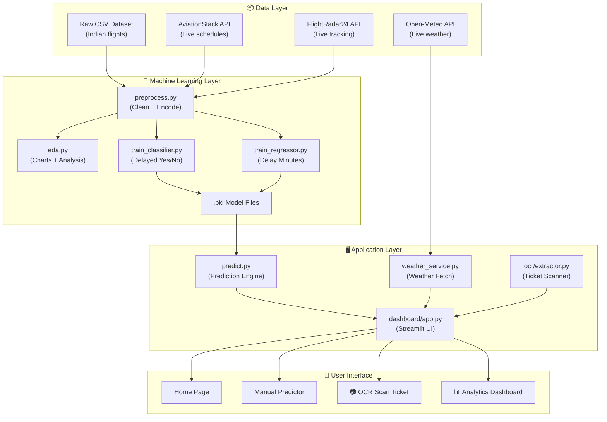
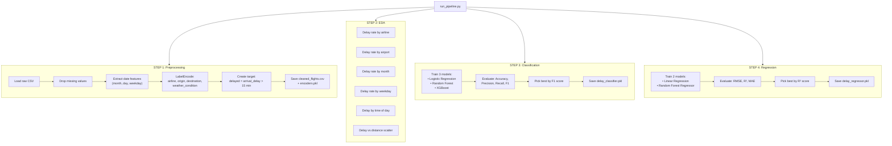
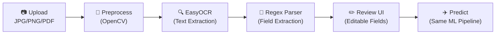
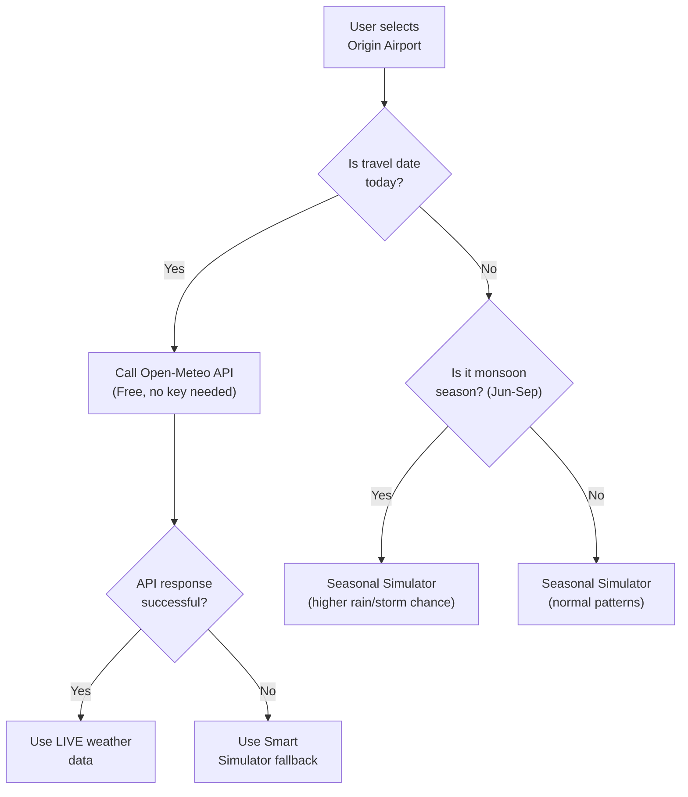

# ✈️ SkyCast Analytics — Complete Project Documentation

## 1. What Is This Project?

**SkyCast Analytics** is a full-stack Machine Learning web application that predicts whether an Indian domestic flight will be delayed and by how many minutes. It uses historical flight data, real-time weather conditions, and trained ML models to give users actionable travel insights through a beautiful Streamlit dashboard.

---

## 2. High-Level Architecture



---

## 3. Technologies Used & Why

### 3a. Data & ML Stack

| Technology | What It Does | Why We Use It |
|-----------|-------------|---------------|
| **Python 3** | Core programming language | Industry standard for ML and data science |
| **Pandas** | Data loading, cleaning, manipulation | Best library for tabular data (CSVs, DataFrames) |
| **NumPy** | Numerical operations | Fast math on arrays; Pandas depends on it |
| **Scikit-Learn** | ML model training + preprocessing | Provides LabelEncoder, train_test_split, and baseline models (Logistic Regression, Random Forest, Linear Regression) |
| **XGBoost** | Advanced gradient boosting classifier | More accurate than basic models; handles imbalanced data well; chosen as the best classifier by F1-score |
| **Joblib** | Model serialization (`.pkl` files) | Saves trained models to disk so the dashboard can load them instantly without retraining |

### 3b. Web & UI Stack

| Technology | What It Does | Why We Use It |
|-----------|-------------|---------------|
| **Streamlit** | Web dashboard framework | Turns Python scripts into interactive web apps with zero HTML/JS knowledge needed |
| **Plotly** | Interactive charts & graphs | Professional-grade charts with hover, zoom, and export — much better than static matplotlib |
| **Folium** | Interactive maps | Renders flight route maps with animated paths between cities |
| **Custom CSS** | Glassmorphism, dark theme, animations | Makes the UI look premium with blur effects, dark cards, gradient buttons |
| **Google Fonts (Inter)** | Typography | Clean, modern font used across the entire dashboard |

### 3c. External APIs

| API | What It Fetches | Cost |
|-----|----------------|------|
| **Open-Meteo** | Live weather (wind, visibility, condition) | **Free** — no API key needed |
| **AviationStack** | Real flight schedules and statuses | Free tier available |
| **FlightRadar24** | Live aircraft positions | Via Python package |

### 3d. OCR Stack (New Feature)

| Technology | What It Does | Why We Use It |
|-----------|-------------|---------------|
| **EasyOCR** | Reads text from images using deep learning | Pure Python — just `pip install`, no external binary needed |
| **OpenCV** | Image preprocessing (grayscale, denoise, threshold) | Cleans up phone photos so OCR accuracy improves |
| **imutils** | Image deskewing (straightening tilted photos) | Fixes tilted ticket photos |
| **pdf2image** | Converts PDF boarding passes to images | Supports PDF upload alongside JPG/PNG |

---

## 4. How Prediction Works — Step by Step

```mermaid
flowchart LR
    subgraph INPUT["Step 1: User Input"]
        U1["Selects Airline"]
        U2["Selects Origin"]
        U3["Selects Destination"]
        U4["Selects Date"]
        U5["Selects Time"]
    end

    subgraph WEATHER["Step 2: Weather Fetch"]
        W1["Open-Meteo API\n(or Seasonal Simulator)"]
        W2["Returns: condition,\nwind_speed, visibility"]
    end

    subgraph ENCODE["Step 3: Feature Encoding"]
        E1["LabelEncoder converts\ntext → numbers"]
        E2["11 features built:\nairline, origin, destination,\nmonth, day, weekday,\ndeparture_time, distance,\nweather_condition,\nwind_speed, visibility"]
    end

    subgraph PREDICT["Step 4: ML Prediction"]
        P1["XGBoost Classifier\n→ Delay probability (%)"]
        P2["Random Forest Regressor\n→ Delay minutes"]
    end

    subgraph OUTPUT["Step 5: Results"]
        O1["Delay Probability\nMetric Card"]
        O2["Estimated Delay\nMetric Card"]
        O3["Risk Alert\n(Green/Yellow/Red)"]
        O4["Weather Insight\nBadge"]
    end

    INPUT --> WEATHER
    WEATHER --> W1 --> W2
    W2 --> ENCODE
    INPUT --> ENCODE
    ENCODE --> E1 --> E2
    E2 --> PREDICT
    PREDICT --> P1
    PREDICT --> P2
    P1 --> OUTPUT
    P2 --> OUTPUT
```



### The 11 Input Features

These are the exact features the ML models use for prediction:

| # | Feature | Type | Example | Source |
|---|---------|------|---------|--------|
| 1 | `airline` | Categorical → Encoded | Air India → 0 | User selection |
| 2 | `origin` | Categorical → Encoded | DEL → 3 | User selection |
| 3 | `destination` | Categorical → Encoded | BOM → 1 | User selection |
| 4 | `month` | Integer 1–12 | 4 (April) | From travel date |
| 5 | `day` | Integer 1–31 | 15 | From travel date |
| 6 | `weekday` | Integer 0–6 | 1 (Tuesday) | From travel date |
| 7 | `departure_time` | Integer (HHMM) | 1430 | From selected time |
| 8 | `distance` | Float (km) | 1400.0 | Lookup table |
| 9 | `weather_condition` | Categorical → Encoded | Rain → 1 | Open-Meteo API |
| 10 | `wind_speed` | Float (km/h) | 22.5 | Open-Meteo API |
| 11 | `visibility` | Float (km) | 4.2 | Open-Meteo API |

### Prediction Logic

| Probability | Color | Message |
|-------------|-------|---------|
| **< 20%** | 🟢 Green | "Great News! Your flight is predicted to be on time." |
| **20–50%** | 🟡 Yellow | "Attention Needed. Moderate risk of delay." |
| **> 50%** | 🔴 Red | "High Risk Alert! Significant delays are very likely." |

---

## 5. The ML Training Pipeline



### Models Compared

**Classification (Is the flight delayed? Yes/No)**

| Model | Optimization Metric | Role |
|-------|-------------------|------|
| Logistic Regression | F1-score | Simple baseline — fast, interpretable |
| Random Forest Classifier | F1-score | Ensemble of decision trees — handles non-linear patterns |
| **XGBoost** ⭐ | F1-score | Gradient boosting — typically wins. Selected as best model |

**Regression (How many minutes delayed?)**

| Model | Optimization Metric | Role |
|-------|-------------------|------|
| Linear Regression | R² score | Simple baseline — assumes linear relationship |
| **Random Forest Regressor** ⭐ | R² score | Ensemble method — captures complex delay patterns |

---

## 6. The OCR Ticket Scanning Feature



| Stage | What Happens | Technology |
|-------|-------------|-----------|
| **Upload** | User uploads a boarding pass photo or PDF | Streamlit `file_uploader` |
| **Preprocess** | Grayscale → Denoise → Threshold → Deskew | OpenCV + imutils |
| **OCR** | AI reads all text from the image | EasyOCR (PyTorch-based) |
| **Parse** | Regex extracts flight #, IATA codes, date, time | Python `re` module |
| **Review** | Fields shown in editable form; low-confidence fields flagged with ⚠️ | Streamlit inputs |
| **Predict** | Feeds into exact same `predict.py` pipeline | XGBoost + Random Forest |

---

## 7. Weather Intelligence System



The weather system considers **India-specific seasonal patterns**:
- **Monsoon months (June–September):** 50% rain probability, 25% storm probability
- **Normal months:** 20% rain probability, 10% storm probability
- **City-specific patterns:** e.g., Kochi gets more rain than Jaipur year-round

---

## 8. All Features at a Glance

| Feature | Page | Description |
|---------|------|-------------|
| 🏠 **Home Page** | Home | Hero section with background image, call-to-action button |
| ✈️ **Manual Predictor** | Predictor | Select airline/route/date/time → get delay prediction |
| 📷 **OCR Ticket Scan** | Scan Ticket | Upload boarding pass photo → auto-extract fields → predict |
| 📊 **Carrier Performance** | Analytics | Box plot: delay distribution per airline |
| 🌧️ **Weather Impact** | Analytics | Bar chart: average delay by weather condition |
| 🗺️ **Regional Trends** | Analytics | Scatter plot: visibility vs delay colored by weather |
| 🌡️ **Live Weather Fetching** | Predictor/Scan | Auto-fetches weather for origin airport before prediction |
| 🎨 **Dark Theme** | Everywhere | Premium glassmorphism UI with Inter font and gradient buttons |

---

## 9. Complete File Map

```
flight_delay_project/
│
├── 📂 data/
│   ├── raw/                          # Raw Indian flights CSV dataset
│   └── processed/                    # cleaned_flights.csv + distance_lookup.json
│
├── 📂 models/
│   ├── preprocess.py                 # Step 1: Clean data + LabelEncode + save encoders
│   ├── eda.py                        # Step 2: Generate 6 Plotly analysis charts
│   ├── train_classifier.py           # Step 3: Train 3 classifiers, pick best by F1
│   ├── train_regressor.py            # Step 4: Train 2 regressors, pick best by R²
│   └── predict.py                    # Load .pkl models and predict for dashboard
│
├── 📂 trained_models/
│   ├── delay_classifier.pkl          # Saved XGBoost classifier
│   ├── delay_regressor.pkl           # Saved Random Forest regressor
│   ├── encoders.pkl                  # Saved LabelEncoders for all categorical features
│   ├── classifier_metrics.json       # Accuracy/Precision/Recall/F1 for all 3 classifiers
│   └── regressor_metrics.json        # RMSE/R²/MAE for all 2 regressors
│
├── 📂 ocr/
│   ├── __init__.py                   # Package init
│   └── extractor.py                  # OCR engine: preprocess → EasyOCR → regex parse
│
├── 📂 dashboard/
│   ├── app.py                        # Main Streamlit application (all pages)
│   ├── assets/
│   │   ├── style.css                 # Dark theme CSS (glassmorphism, animations)
│   │   └── templates.py              # HTML templates (hero section)
│   └── charts/                       # EDA chart JSONs rendered by Plotly
│
├── 📂 utils/
│   ├── weather_service.py            # Open-Meteo API + seasonal simulator
│   └── live_flight_service.py        # AviationStack + FlightRadar24 integration
│
├── run_pipeline.py                   # Runs all 4 ML steps in sequence
├── requirements.txt                  # All Python dependencies
├── Dockerfile                        # Container deployment config
├── Procfile                          # Render/Heroku deployment
└── README.md                         # Project overview
```

---

## 10. How To Run

```bash
# 1. Install dependencies
pip install -r requirements.txt

# 2. Train models (only needed once)
python run_pipeline.py

# 3. Launch the dashboard
streamlit run dashboard/app.py
```

> **Tip:** The dashboard will open at `http://localhost:8501`. You can use either the **Manual Predictor** (select flight details from dropdowns) or the **OCR Scan Ticket** (upload a boarding pass photo) to get delay predictions.
